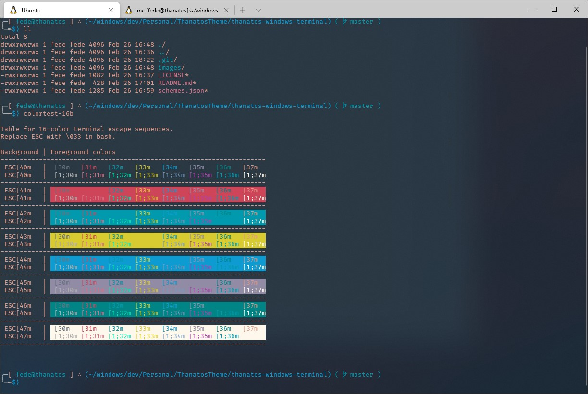

# Thanatos Theme for Windows Terminal

Based on my vsCode theme that you can find [here](https://marketplace.visualstudio.com/items?itemName=fede-crc.thanatos).

It has a dark and light modes and it looks like this:

⚠ (Add `"cursorColor" : "#0e639c"` to any profile that uses the Light theme, for cursor visibility)

This is a work in progress and all suggestions and bug reports are welcomed, thanks for looking 👍.